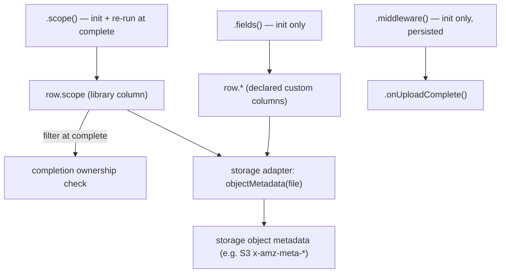

# Decouple auth/storage and make persisted file data customizable

## Summary

Remove the domain-coupled columns (`uploadedBy`, `entityId`) from the library's canonical file row. Replace ownership with an opaque, library-owned `scope` token, and let users declare their own typed persisted columns centrally (BetterAuth `additionalFields`-style). Split the overloaded "metadata" concept into two sinks with distinct lifecycles, and push storage-object metadata down into the storage adapter so the core carries no auth and no storage-vendor concepts.

## Problem Frame

The library presents itself as a generic file-upload library, but two domain concerns have leaked into its core shape.

`uploadedBy` is not just a column: it is woven into the completion security model. `findFilesByBatchIdAndUploadedBy` and `updateFilesToStored` scope batch completion by owner (`packages/server/src/router/core.ts:150,203`; `packages/server/src/adapters/prisma.ts:48,78`), and `ValidContextObject` hardcodes a `userId?` field (`packages/core/src/types.ts`, `packages/core/src/router-types.ts:20`). A file-upload library should not know what a "user" is.

`entityId` is the only structured field the `.metadata()` builder step produces (`MetadataObject = { entityId?: string }`, `packages/core/src/router-types.ts:38`). It is threaded into both a DB column and the S3 object's metadata, with no way for a consumer to add their own persisted data or to choose where a value lands.

The word "metadata" is overloaded across two genuinely different sinks. `packages/server/src/adapters/s3.ts:50` forces `uploaded-by`, `usage-context`, and `entity-id` into S3 object metadata, while `packages/server/src/router/core.ts:116` writes the same data as DB columns. The two sinks have different constraints and different lifecycles, but the current design treats them as one thing.

## Key Decisions

- **Ownership becomes an opaque `scope` token, library-owned.** The library scopes completion on a single `string | undefined` value it never interprets — it may hold a userId, an orgId, a composite like `"user:A|org:X"`, or nothing. This keeps the completion guarantee (only the original scope finalizes a batch) while removing every notion of auth from the core. It replaces `uploadedBy`.

- **Custom persisted fields are declared centrally and typed.** There is one file table, so the column set is declared once on the `UploadStuff()` config (mirroring BetterAuth `additionalFields`), and values are provided per-route. Central declaration is what lets types reach the database adapter and gives a clear migration story; route-local inference would leave the persisted shape as an untyped union.

- **Two sinks, separated by lifecycle, not merged behind a flag.** Storage object metadata (string-only, capped, set at PUT, immutable) and DB columns (typed, mutable, queryable) are distinct concerns. They stay separate concepts rather than one declaration with a per-field destination flag, because a unified model would leak the divergent constraints.

- **Storage object metadata moves into the storage adapter.** Object metadata is a storage-vendor concept (S3/GCS/R2 have it; a generic byte store may not). Moving it out of the route builder serves the storage-agnostic goal and removes a builder method; the adapter, which already knows it is S3, derives metadata from the file row.

- **Distinct builder methods over a single consolidated resolver.** The builder steps map to distinct lifecycles (`middleware` runs at init; `fields` persists at init; `onUploadComplete` runs once at completion). Collapsing them into one resolver would re-create the same conflation the redesign removes. The accepted surface is five methods.

## Requirements

**Ownership (`scope`)**

- R1. The route builder exposes `.scope(fn)`; the resolver returns an opaque `string | undefined` derived from request context, and the library never interprets the value.
- R2. `scope` is persisted as a library-owned column on the file row at init.
- R3. The `.scope()` resolver re-runs at completion; the batch lookup is filtered by the re-derived scope and a mismatch rejects the completion.
- R4. An undefined scope denotes an anonymous batch; anonymous and owned batches never cross-match (current `?? null` semantics, preserved).

**Custom DB fields**

- R5. Custom persisted fields are declared centrally on the `UploadStuff()` config with name, type, and required/optional.
- R6. A route provides values via `.fields(fn)`, whose resolver receives `{ ctx, input, middlewareData, files }` and whose return is typed against the central declaration.
- R7. Declared field types flow end-to-end — into the database adapter's persisted-row type and into what the route surfaces.
- R8. `entityId` is no longer built in; the library ships zero domain columns, and `entityId` becomes a user-declared field where needed.

**Two sinks / storage metadata**

- R9. Neither the core nor the route builder produces storage object metadata; the core carries no storage-vendor concept.
- R10. The storage adapter optionally derives storage object metadata from the file row (e.g. `s3Adapter({ objectMetadata: (file) => Record<string, string> })`), evaluated at presign/PUT time.

**Builder and context API**

- R11. The route-builder surface is exactly `input`, `scope`, `middleware`, `fields`, `onUploadComplete`.
- R12. `middleware` runs once at init; its result is persisted and forwarded to `onUploadComplete` at completion, and it may throw to reject a request. It is not re-run at completion — `scope` owns the completion ownership check.
- R13. `ctx` is fully user-defined; the library no longer requires a `userId` field on the context type.

**Adapter and persistence contract**

- R14. The `DatabaseAdapter` interface drops `uploadedBy` from its method names and parameters and scopes by `scope` instead (e.g. `findFilesByBatchIdAndScope`, `updateFilesToStored({ batchId, scope, storedAt })`).
- R15. The canonical persisted row is the library state-machine columns plus declared custom fields; `uploadedBy` and `entityId` leave the built-in shape.
- R16. `uploadSessionData` stores `{ input, middlewareData, endpoint }`; `middlewareData` is persisted and forwarded to `onUploadComplete` (not recomputed).

## How the data fans out

Each route resolver feeds a specific sink at a specific moment. The file row is the single source of truth that the storage adapter reads from — the core never writes storage metadata directly.

Canonical row shape, before and after:

| Before (`DatabaseFile`) | After |
|---|---|
| state-machine columns | state-machine columns (unchanged) |
| `uploadedBy?` | `scope?` (opaque, library-owned) |
| `entityId?` | removed — declarable as a custom field |
| — | declared custom columns (typed, central declaration) |

## Acceptance Examples

- AE1. Owner finalizes own batch.
  - **Given:** a batch initialized with `scope = "user:A"`.
  - **When:** the same principal completes it (re-derived `scope = "user:A"`).
  - **Then:** the batch finalizes and `onUploadComplete` runs once. **Covers R3.**
- AE2. Different principal attempts finalize.
  - **Given:** a batch initialized with `scope = "user:A"`.
  - **When:** a request whose re-derived `scope = "user:B"` calls complete with the batchId.
  - **Then:** the lookup matches no rows and the completion is rejected; `onUploadComplete` does not run. **Covers R3.**
- AE3. Anonymous batch.
  - **Given:** a batch initialized with `scope` undefined.
  - **When:** any request completes it with the batchId.
  - **Then:** it finalizes — a leaked batchId is acceptable here because nothing private is protected. **Covers R4.**

## Scope Boundaries

**Deferred for later**

- `.fields()` re-running at completion to update columns — init-only for v1.
- Helpers for composite or multi-dimension scopes — the opaque string already supports them by convention.
- `objectMetadata` support on storage adapters other than S3.

**Outside this library's identity**

- The library managing auth, sessions, or users — ownership stays an opaque token supplied by the consumer.
- A general-purpose Prisma adapter — it remains a reference adapter for one `File` shape (`README.md:223`).

## Dependencies / Assumptions

- This is a breaking change to the entire public API (builder, adapter interface, `ctx` type, persisted columns). Accepted because the library is young and no migration path for existing consumers is required.
- `.scope()` must be deterministic per principal — the same value at init and at completion. Non-determinism (e.g. `Date.now()`) breaks completion. The footgun is contained to this one resolver, not the whole middleware.
- Storage object metadata constraints (string-only, ~2KB total, immutable after PUT) are the storage adapter's concern, not the core's.

## Outstanding Questions

**Deferred to planning**

- Exact `.scope()` resolver signature — whether it receives `middlewareData` or only `{ ctx, input, files }`.
- Default behavior of `objectMetadata` on `s3Adapter` (empty vs. mirroring today's `uploaded-by`/`usage-context`/`entity-id`).
- Whether `usageContext` stays a library-owned column or becomes derivable, and whether the adapter mirrors it to storage metadata.
- Final generic naming of the `DatabaseAdapter` scope methods.

## Sources / Research

- `packages/core/src/types.ts` — `DatabaseFile`, `DatabaseAdapter`, `StorageAdapter`, `ValidContextObject`.
- `packages/core/src/router-types.ts` — `MetadataObject`, the `UploadBuilder` chain.
- `packages/server/src/router/core.ts` — init/complete handlers, the `uploadedBy` completion filter, `uploadSessionData`.
- `packages/server/src/router/handler.ts` — builder-step orchestration at init/complete.
- `packages/server/src/adapters/s3.ts` — current S3 object-metadata population.
- `packages/server/src/adapters/prisma.ts` — `?? null` anonymous-scoping semantics.
- `README.md` — current public API and reference Prisma `File` model.
- BetterAuth `additionalFields` (declaration-model reference): central per-field `{ type, required, defaultValue, input }` on the auth config, with end-to-end type inference.
