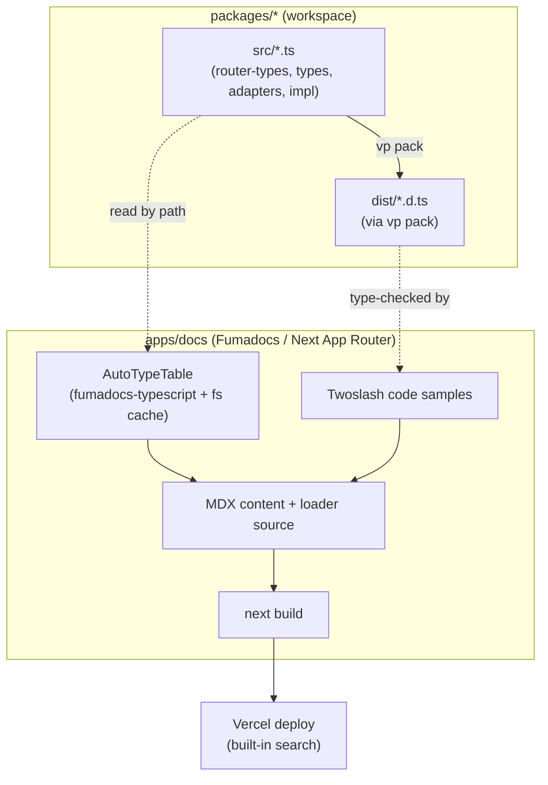
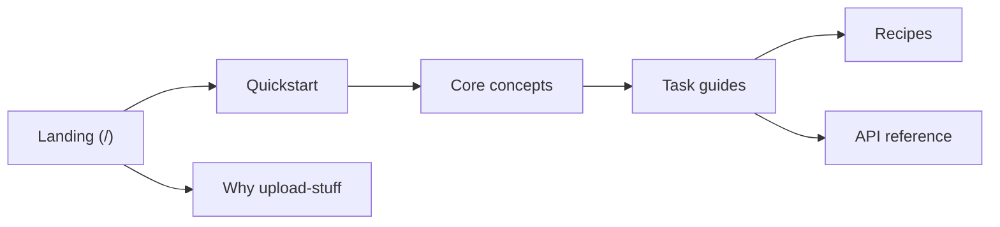

# feat: Fumadocs documentation site as npm-launch adoption surface

## Summary

Build a public Fumadocs (Next.js App Router) documentation site at `apps/docs` in
this pnpm monorepo, as the adoption surface for the upcoming `@upload-stuff/*` npm
launch. The site imports the real workspace packages so its API reference
(`fumadocs-typescript` AutoTypeTable, with hand-authored fallback tables for the
generic types) and its Twoslash-checked code samples stay correct against the
actual API. v1 ships a landing page, quickstart, core concepts, task guides,
recipes, a "why upload-stuff" comparison, and the API reference, plus the
monorepo, lint, and deploy wiring a Next app needs inside this vite-plus repo.

## Problem Frame

The library is feature-complete enough to publish (v0.0.0, unpublished) but has
only a ~337-line `README.md`. That README is a competent reference for someone
already committed, but it is the wrong shape for the launch moment that matters:
a developer evaluating `upload-stuff` against UploadThing or a hand-rolled
presigned-S3 flow. There is no landing page, no first-five-minutes path, no
navigable concept/guide separation, and no positioning. The library is also
heavily typed (a Hono RPC layer, a generic file-router builder, Standard Schema
inputs), so hand-maintained API docs and samples drift the moment a signature
changes — and stale examples on an adoption surface cost trust. The plan builds
a docs site whose correctness is mechanized wherever the type shapes allow.

---

## Requirements

Traceability is to the origin requirements doc (see `origin`). Origin IDs R1–R13
are referenced verbatim; the unit that satisfies each is noted.

**Site and infrastructure**

- R1. Fumadocs (Next.js App Router) app at `apps/docs`. (U2)
- R2. `apps/*` added to the workspace; docs depends on `@upload-stuff/*` via the
  workspace protocol so it imports real types. (U1, U2)
- R3. Standalone public deployment with Fumadocs' built-in search. (U2, U10)

**Content (v1)**

- R4. Landing page: value prop, "why upload-stuff" pitch, typed code peek, CTAs. (U5)
- R5. Quickstart from stated prerequisites to a working Next.js upload in ~5
  minutes. (U6)
- R6. Core concepts: file router, presigned-S3 flow, adapters, usage contexts,
  the upload init/complete lifecycle, and file cleanup. (U6)
- R7. Task guides: Next.js handler, S3 adapter, Prisma adapter + `File` model,
  the `DatabaseAdapter` / storage interface for custom backends, client hooks,
  server utilities, image compression. (U7)
- R8. Recipes: avatar, document-with-`.input()`, cleanup cron, direct
  server-side upload. (U8)
- R9. "Why upload-stuff" comparison vs UploadThing and rolling-your-own, stating
  the bring-your-own-S3 trade-off. (U5)

**API reference and code correctness**

- R10. Auto-generated reference covering `RouteConfig`, `DatabaseAdapter`, the
  storage interface, `FileRoute`, builder methods, and hook return types —
  AutoTypeTable where it renders cleanly, hand-authored fallback tables
  otherwise. (U3, U9)
- R11. Code samples Twoslash-typechecked so a sample that no longer matches the
  current API fails the docs build. (U4)

**Launch and README relationship**

- R12. Docs go-live sequenced with the v0.x npm publish via a staged publish. (U10)
- R13. `README.md` slimmed to a short install + minimal example that links to the
  docs site as canonical. (U10)

---

## Key Technical Decisions

- **Fumadocs `+next+fuma-docs-mdx`, scaffolded with `create-fumadocs-app`.**
  Next.js App Router native, MDX, built-in search, free, owned output (see
  origin). The scaffold gives the content-source + loader wiring rather than
  hand-building it.

- **Docs app gets its own `tsconfig.json`, not a blind extend of
  `tsconfig.base.json`.** The base sets `verbatimModuleSyntax: true` and
  `noUncheckedIndexedAccess`, which fight Next/MDX/React import idioms. Use Next's
  generated tsconfig and pull from the base selectively. `moduleResolution:
  "Bundler"` is shared and compatible.

- **Two distinct type-source paths.** Twoslash samples type-check against the
  built `dist/*.d.ts`, so the docs build depends on `vp pack` of the three libs
  (automatic under `vp run -r` dependency order; `dev --parallel` keeps `dist`
  fresh). AutoTypeTable reads `packages/*/src/*.ts` directly by relative path and
  needs the `fumadocs-typescript` filesystem generator cache configured for the
  Vercel serverless build. See High-Level Technical Design.

- **Hybrid API reference.** AutoTypeTable renders the plain object/interface
  types (`RouteConfig`, `DatabaseAdapter`, `StorageAdapter`, `DatabaseFile`, the
  `*Result` types, `CreateUploadStuffClientOptions`, `UseUploadStuffOptions`,
  `UseUploadStuffReturn` — the hook return shape).
  The generic/conditional types (`UploadBuilder` methods, `FileRoute`,
  `StartUploadFn`, `UploadStuff`, infer-types) will not render usefully and use
  hand-authored fallback tables — the README already carries reusable
  `RouteConfig` and builder-method tables. A spike (U3) confirms the exact split.

- **Root lint accommodation for a Next app.** `pnpm lint` is one root
  type-aware Oxlint pass (`vp lint .`, `typeCheck: true`) with
  `ignorePatterns` covering only `dist`/`node_modules`. Extend `ignorePatterns`
  with `**/.next/**`, `**/.source/**`, `**/next-env.d.ts`, and add an
  `apps/docs/**` `lint.overrides` entry relaxing the strict base rules
  (`typescript/no-explicit-any`, select `unicorn` rules) for Next/MDX idioms.
  Keep `.gitignore` in sync. The `prefer-vite-plus-imports` rule does not fire on
  a Next app (it only targets `vite`/`vitest` imports).

- **Docs build decoupled from package release.** `apps/docs` is `private: true`
  and stays out of the `.changeset` `fixed` group, so `changeset publish` skips
  it. The root `build`/`release`/`check-types` scripts are scoped to `packages/*`
  (via `vp -F`), because `vp run -r` would otherwise recurse into `apps/docs` and
  a failed `next build` would abort `changeset publish` through the `&&`. Vercel
  builds the docs independently. A docs build can never block a package publish.

- **Quickstart correctness is type-checked, not runtime-tested in CI.** Twoslash
  proves samples compile against current types; a manual e2e checklist validates
  the actual upload once before launch. No CI e2e harness (LocalStack/MinIO) for
  v1 — out of proportion for a docs site.

- **Staged publish gates go-live.** Cut a prerelease/dist-tag, validate
  `npm install @upload-stuff/*` and the quickstart against the real registry,
  choose the domain, then flip docs go-live and the README link. Sequenced with
  the publish but decoupled enough that a slip in one need not block the other.

- **Pin React 19 + react-dom in docs.** Matches the client package's `react >=19`
  peer (React 19 is already resolved in the lock) and Next App Router.

---

## High-Level Technical Design

The defining shape is the two type-source paths feeding one Next build. Twoslash
consumes built declaration files; AutoTypeTable consumes source `.ts` directly.



Content information architecture (sidebar groups under `/docs`):



---

## Output Structure

Greenfield directory; the per-unit `**Files:**` lists remain authoritative.

```text
apps/docs/
  package.json            # private:true, react 19, fumadocs deps, @upload-stuff/* workspace deps
  next.config.mjs         # fumadocs MDX plugin + transpilePackages for @upload-stuff/*
  source.config.ts        # content source + MDX (Twoslash) config
  tsconfig.json           # Next-based, selective base extends
  mdx-components.tsx      # registers AutoTypeTable + Twoslash components
  lib/source.ts           # loader() over docs collection
  app/
    layout.tsx
    (home)/page.tsx       # landing + code peek
    docs/[[...slug]]/page.tsx
    docs/layout.tsx
  content/docs/
    quickstart.mdx
    concepts/*.mdx
    guides/*.mdx
    recipes/*.mdx
    api/*.mdx
    why.mdx
```

---

## Implementation Units

### U1. Onboard a Next app into the monorepo

- **Goal:** Make the repo accept a Next/Fumadocs app without breaking the root
  lint, build, or git hygiene — before the app exists.
- **Requirements:** R2.
- **Dependencies:** none.
- **Files:** `pnpm-workspace.yaml` (add `- "apps/*"`), `.gitignore` (add
  `.next/`, `.source/`, `.vercel/`, `out/`, `next-env.d.ts`),
  `vite.config.ts` (extend `lint.ignorePatterns` with `**/.next/**`,
  `**/.source/**`, `**/next-env.d.ts`; add `lint.overrides` scoped to
  `apps/docs/**`), root `package.json` (scope the recursive `build` / `release`
  / `check-types` scripts to `packages/*` — e.g. `vp run -F './packages/*' build`
  — so a docs build never enters the publish path).
- **Approach:** Keep the lint override minimal — relax only what Next/MDX idioms
  require (`typescript/no-explicit-any` and select `unicorn` rules), preserving
  the base rule set elsewhere. Keep `.gitignore` and `ignorePatterns` entries
  identical so generated output is ignored by both tools. Do not add `apps/docs`
  to `.changeset` `fixed` or to root `test.projects` for v1.
- **Patterns to follow:** mirror the existing `**/*.ts*` override block structure
  in `vite.config.ts`; the `vite-plus` `lint.overrides` keying from the repo's
  monorepo config convention.
- **Test scenarios:** Covers nothing behavioral. Test expectation: none — config;
  validated by `pnpm lint` passing on the repo with an empty `apps/docs/`
  placeholder and by generated dirs not appearing in `git status`.
- **Verification:** `pnpm lint` succeeds; `.next/`/`.source/` are git-ignored.

### U2. Scaffold the Fumadocs app

- **Goal:** A running Fumadocs site at `apps/docs` that imports the workspace
  packages and renders an empty docs tree with working search.
- **Requirements:** R1, R2, R3.
- **Dependencies:** U1.
- **Files:** `apps/docs/package.json`, `apps/docs/next.config.mjs`,
  `apps/docs/source.config.ts`, `apps/docs/tsconfig.json`,
  `apps/docs/lib/source.ts`, `apps/docs/mdx-components.tsx`,
  `apps/docs/app/layout.tsx`, `apps/docs/app/docs/layout.tsx`,
  `apps/docs/app/docs/[[...slug]]/page.tsx`, `apps/docs/app/(home)/page.tsx`
  (placeholder).
- **Approach:** Scaffold with `pnpm create fumadocs-app` (template
  `+next+fuma-docs-mdx`), then relocate into `apps/docs`. Set `private: true`,
  pin `react`/`react-dom` to 19, add `@upload-stuff/{core,server,client}` as
  `workspace:*` deps. In `next.config.mjs` add `transpilePackages` for the
  workspace packages and the fumadocs MDX plugin. Give the app its own
  `tsconfig.json` (Next default + selective base settings), not a blind base
  extend. Define the sidebar groups (concepts / guides / recipes / api) as the
  nav structure.
- **Patterns to follow:** Fumadocs `loader()` + `source.config.ts` content-source
  pattern (Sources & Research).
- **Test scenarios:** Test expectation: none — scaffold; validated by `pnpm
  --filter docs dev` serving the site, the docs route rendering, and search
  returning results for seeded content.
- **Verification:** `next build` succeeds; the dev server renders the docs shell
  with working search; workspace package imports resolve.

### U3. AutoTypeTable wiring + feasibility spike

- **Goal:** Generate API tables from real source types, and pin down which types
  render cleanly vs need hand-authored fallback.
- **Requirements:** R10.
- **Dependencies:** U2.
- **Files:** `apps/docs/package.json` (`fumadocs-typescript` dep),
  `apps/docs/mdx-components.tsx` (register `AutoTypeTable` with a
  `createFileSystemGeneratorCache` generator), `apps/docs/source.config.ts` (if
  the remark plugin route is used), a scratch `apps/docs/content/docs/api/`
  page for the spike.
- **Approach:** Configure the generator with a filesystem cache (required for
  the Vercel serverless build). Point `AutoTypeTable path=` at
  `packages/*/src/*.ts` relative paths. Spike against the hard cluster in
  `packages/core/src/router-types.ts` (`UploadBuilder`, `FileRoute`,
  `StartUploadFn`) and `packages/server/src/upload-stuff.ts` (`UploadStuff`).
  Record the resolved split; for types that do not render, adopt the README's
  hand-authored tables as the named fallback set.
- **Patterns to follow:** README `RouteConfig` table (`README.md`) and
  builder-method table as fallback content; `fumadocs-typescript` cache setup
  (Sources & Research).
- **Test scenarios:**
  - Covers AE3. Add a field to `RouteConfig` in `packages/core/src/router-types.ts`,
    rebuild docs, and confirm the generated table shows the new field with no
    manual edit.
  - Render `DatabaseAdapter` and `StorageAdapter` and confirm method signatures +
    JSDoc appear.
  - Confirm a generic type from the hard cluster either renders acceptably or is
    routed to the hand-authored fallback (no broken/empty table shipped).
- **Verification:** The spike's split is documented; friendly types render from
  source; the fallback set is enumerated and sourced.

### U4. Twoslash type-checked samples + build ordering

- **Goal:** Code samples across the site fail the docs build when they drift from
  the current API.
- **Requirements:** R11.
- **Dependencies:** U2.
- **Files:** `apps/docs/source.config.ts` (Twoslash MDX/rehype transformer),
  `apps/docs/package.json` (Twoslash integration + `@aws-sdk/client-s3` /
  `@aws-sdk/s3-request-presigner` and `zod` (pinned to the workspace version
  `4.1.11`) as devDeps so every sample import resolves under pnpm's isolated
  node_modules), root `package.json` / build ordering note.
- **Approach:** Enable the Fumadocs Twoslash transformer so ` ```ts twoslash `
  blocks are type-checked at build. Twoslash resolves against built `dist`
  types, so the docs build must run after `vp pack` of the libs (dependency
  order under `vp run -r`; `dev --parallel` keeps `dist` fresh). Add the AWS SDK
  devDeps because the S3 adapter samples reference `S3ClientConfig` from the
  optional peer.
- **Patterns to follow:** Fumadocs ` ```ts twoslash ` markdown support (Sources &
  Research); existing README server/client snippets as sample seeds.
- **Test scenarios:**
  - Covers AE2. Rename or remove an export referenced by a Twoslash sample;
    confirm `next build` fails on the Twoslash check.
  - A correct sample importing `@upload-stuff/server` and `@upload-stuff/client`
    type-checks and renders hover types.
  - An S3-adapter sample resolves `S3ClientConfig` types (AWS SDK devDep present).
- **Verification:** `next build` fails on a deliberately broken sample and passes
  once corrected.

### U5. Landing page + "why upload-stuff" comparison

- **Goal:** Communicate the value prop and positioning so an evaluator can decide
  to adopt.
- **Requirements:** R4, R9.
- **Dependencies:** U2, U4.
- **Files:** `apps/docs/app/(home)/page.tsx`, `apps/docs/content/docs/why.mdx`,
  `apps/docs/content/docs/meta.json` (pin `why.mdx` first in the sidebar, before
  quickstart, so search/direct-link readers have a nav anchor).
- **Approach:** Landing carries the value prop, a code peek, and CTAs
  (quickstart, install). The code peek demonstrates the differentiator — a typed
  route definition whose client hook return type is inferred from it without
  annotation — not a generic import snippet. Landing layout: the headline + value
  prop and the typed code peek share the first viewport (peek not below the fold);
  CTAs sit below (quickstart primary, install secondary). Below ~768px the peek is
  full-width with a shortened single-function excerpt (no horizontal scroll) and
  CTAs stack with ≥44px touch targets. The "why" page is a side-by-side code
  comparison (upload-stuff typed router vs UploadThing vs raw presigned-URL
  boilerplate) rendered as Fumadocs `<Tabs>` (one tab per option) with a prose
  summary after the tabs that states the bring-your-own-S3 trade-off honestly;
  tabs stack vertically on mobile.
- **Patterns to follow:** README positioning line as the value-prop seed; typed
  router + inferred client types from `packages/core/src/router-types.ts` and
  `packages/client/src/impl.ts`.
- **Test scenarios:** Test expectation: none — content; the code peek and
  comparison snippets are Twoslash-checked (U4), and validated by `next build` +
  link check.
- **Verification:** Landing renders with working CTAs; comparison snippets
  type-check; BYO-S3 trade-off is stated.

### U6. Quickstart + core concepts

- **Goal:** Get a prepared reader to a working upload, and explain the mental
  model behind it.
- **Requirements:** R5, R6.
- **Dependencies:** U2, U4.
- **Files:** `apps/docs/content/docs/quickstart.mdx`,
  `apps/docs/content/docs/concepts/*.mdx`.
- **Approach:** Quickstart names prerequisites up front (Next.js app; S3 bucket
  with CORS + credentials) and links out to AWS bucket/CORS setup rather than
  assuming it. Core concepts cover the file router, presigned-S3 flow, adapters,
  usage contexts, the init/complete lifecycle, and **file cleanup** (the home
  for the cleanup-cron recipe in U8). Add a persistent non-Next.js callout: the
  v1 quickstart targets Next.js App Router; the library is fetch-compatible and
  other-runtime guides are deferred, so a Remix/SvelteKit/Hono evaluator can
  decide rather than abandon.
- **Patterns to follow:** README server steps (create instance → file router →
  route handler) and client setup as the quickstart spine; all samples
  Twoslash-checked.
- **Test scenarios:**
  - Covers AE1 (manual). Following only the quickstart from the stated
    prerequisites reaches a working upload without opening `packages/` source —
    validated once via the manual e2e checklist, not CI.
  - All quickstart/concept code blocks are Twoslash-checked (U4).
- **Verification:** Manual e2e checklist passes once pre-launch; `next build` +
  Twoslash pass; concepts cover the cleanup lifecycle.

### U7. Task guides

- **Goal:** How-to coverage for each integration seam.
- **Requirements:** R7.
- **Dependencies:** U2, U4.
- **Files:** `apps/docs/content/docs/guides/*.mdx` (Next.js handler, S3 adapter,
  Prisma adapter + `File` model, custom `DatabaseAdapter`/storage interface,
  client hooks, server utilities, image compression).
- **Approach:** Migrate and expand the README guide sections. The custom-adapter
  guide documents implementing the in-scope `DatabaseAdapter` / storage
  interface (not a catalog of third-party backends). Image compression gets its
  own guide here (resolving the origin orphan). Prisma guide includes the
  required `File` model.
- **Patterns to follow:** README S3/Prisma/custom-adapter/server-utilities
  sections; `packages/client/src/compress-images.ts` for the image-compression
  guide.
- **Test scenarios:** Test expectation: none — content; samples Twoslash-checked
  (U4), validated by `next build` + link check.
- **Verification:** Each guide renders; samples type-check; the Prisma `File`
  model is present and accurate.

### U8. Recipes

- **Goal:** Task-oriented end-to-end patterns.
- **Requirements:** R8.
- **Dependencies:** U6, U7.
- **Files:** `apps/docs/content/docs/recipes/*.mdx` (avatar, document-with-
  `.input()`, cleanup cron, direct server-side upload).
- **Approach:** A curated index rendered as a markdown table — columns
  Recipe | What it does | Adapters | Complexity (Starter / Intermediate) — not an
  undifferentiated card grid. The recipe list is capped at
  the four named for v1 (no open-ended expansion). The cleanup-cron recipe links
  back to the file-cleanup concept added in U6.
- **Patterns to follow:** README `serverUtils` (`cleanUpFiles`, `uploadFile`,
  `deleteFiles`) for the cleanup-cron and direct-server-upload recipes.
- **Test scenarios:** Test expectation: none — content; samples Twoslash-checked
  (U4), validated by `next build` + link check.
- **Verification:** Four recipes render via the curated index; cleanup-cron
  references the concept page.

### U9. API reference pages

- **Goal:** Complete the reference from the U3 split — AutoTypeTable for friendly
  types, hand-authored tables for the rest.
- **Requirements:** R10.
- **Dependencies:** U3.
- **Files:** `apps/docs/content/docs/api/*.mdx`.
- **Approach:** Generate tables for `RouteConfig`, `DatabaseAdapter`,
  `StorageAdapter`, `DatabaseFile`, the `*Result` types,
  `CreateUploadStuffClientOptions`, `UseUploadStuffOptions`, `UseUploadStuffReturn`
  (the hook return shape) via AutoTypeTable.
  Author fallback tables for the builder methods, `FileRoute`, `StartUploadFn`,
  and `UploadStuff` (reusing README tables), each marked as the drift-prone
  exception so future signature changes flag a manual update.
- **Patterns to follow:** README builder-method and `RouteConfig` tables;
  AutoTypeTable config from U3.
- **Test scenarios:**
  - Covers AE3. A field added to a friendly type appears in its generated table
    after rebuild.
  - The hand-authored fallback tables match the current signatures at write time.
- **Verification:** Every R10-named type has a table (generated or hand-authored);
  no empty/broken generated tables ship.

### U10. Launch wiring — staged publish, deploy, README slim

- **Goal:** Deploy the site and sequence go-live with the npm publish without
  coupling failures.
- **Requirements:** R3, R12, R13.
- **Dependencies:** U5, U6, U9. U10 is launch-blocking and depends only on
  launch-blocking content; U7 (guides) and U8 (recipes) are fast-follow and must
  not gate go-live, so they are deliberately excluded from U10's prerequisites.
- **Files:** Vercel project config (dashboard or `apps/docs/vercel.json` if
  needed), `README.md` (slim to install + minimal example linking to the site).
- **Approach:** Configure a Vercel project rooted at `apps/docs` with pnpm 9 and
  a build that runs the workspace package builds first (so `dist` types exist for
  Twoslash) and the `fumadocs-typescript` cache for AutoTypeTable, with Vercel's
  "Include files outside the Root Directory" enabled so AutoTypeTable can read
  `packages/*/src` and the workspace deps resolve. Keep the docs
  build out of the root `release` recursion. Stage the publish: prerelease/
  dist-tag → validate `npm install @upload-stuff/*` + quickstart against the real
  registry → choose the domain → flip docs go-live and add the README link.
  Slim the README last, pointing to the now-live site as canonical.
- **Patterns to follow:** `.changeset` publish flow; the staged-publish KTD.
- **Test scenarios:** Test expectation: none — deploy/docs; validated by a
  successful Vercel build, a passing `npm install` against the prerelease, and
  the README link resolving to the live domain.
- **Verification:** Site is live with search; `npm install` of the prerelease
  works; README links to the live site and no longer duplicates the full guide.

---

## Scope Boundaries

**Deferred for later** (from origin)
- Docs versioning / per-release docs.
- Guides for non-Next.js runtimes (a callout ships in U6; full guides do not).
- Internationalization.

**Outside this product's identity** (from origin)
- Hosted SaaS docs (Mintlify and similar).
- A catalog of backend-specific adapter guides beyond the reference Prisma
  adapter and the documented interface.

**Deferred to Follow-Up Work**
- CI e2e harness for the quickstart (LocalStack/MinIO) — manual checklist for v1.
- Validating the published-install surface for optional peers (AWS SDK / Prisma)
  beyond a one-time prerelease check.
- A docs `check-types` entry in root `test.projects`.

---

## Risks & Dependencies

- **AutoTypeTable will not render the generic public API** (`UploadBuilder`,
  `FileRoute`, `StartUploadFn`, `UploadStuff`). Mitigation: the U3 spike + named
  hand-authored fallback tables; treat those tables as the only drift-prone
  surface.
- **The reference tracks workspace source, not the published artifact.**
  AutoTypeTable reads `src`; Twoslash checks `dist`. Neither exercises the
  published-install surface (incl. the optional AWS SDK peer for the S3 adapter).
  Mitigation: the prerelease install check in U10.
- **Root lint is one type-aware pass.** Without the U1 ignore/override wiring,
  `vp lint .` type-checks Next's generated output and fails. U1 lands first.
- **Dead README link risk.** R13 links the README to the docs domain at publish;
  if the domain slips, the highest-traffic link breaks. Mitigation: choose the
  domain before flipping the README link (U10 sequencing).
- **Distribution, not conversion, is the real pre-launch constraint** for a
  zero-user library — a polished site does not drive traffic by itself. Noted as
  context; out of scope for this plan.

---

## Open Questions

**Deferred to implementation**
- Domain name and Vercel hosting specifics (chosen during U10, before the README
  link flips).
- Whether the "why upload-stuff" page names UploadThing directly or stays neutral
  (content call during U5; default: name it, factually).
- The exact AutoTypeTable-vs-hand-table split, resolved by the U3 spike.

---

## Sources / Research

- `docs/brainstorms/2026-06-14-docs-site-requirements.md` — origin requirements,
  flows, acceptance examples, scope, and the Deferred / Open Questions resolved
  here.
- `README.md` — migration source for guides/quickstart and the reusable
  `RouteConfig` + builder-method tables used as the AutoTypeTable fallback.
- Type sources for the reference: `packages/core/src/router-types.ts`,
  `packages/core/src/types.ts`, `packages/core/src/schemas.ts`,
  `packages/server/src/adapters/s3.ts`, `packages/server/src/adapters/prisma.ts`,
  `packages/server/src/upload-stuff.ts`, `packages/client/src/impl.ts`.
- Repo wiring: `pnpm-workspace.yaml`, `vite.config.ts` (root lint block),
  `tsconfig.base.json`, `.gitignore`, `.changeset/config.json`, each
  `packages/*/vite.config.ts`.
- Fumadocs documentation (Context7 `/fuma-nama/fumadocs`):
  `create-fumadocs-app` (`+next+fuma-docs-mdx`), `loader()` content source,
  `fumadocs-typescript` AutoTypeTable + filesystem generator cache, ` ```ts
  twoslash ` samples, deployment.
