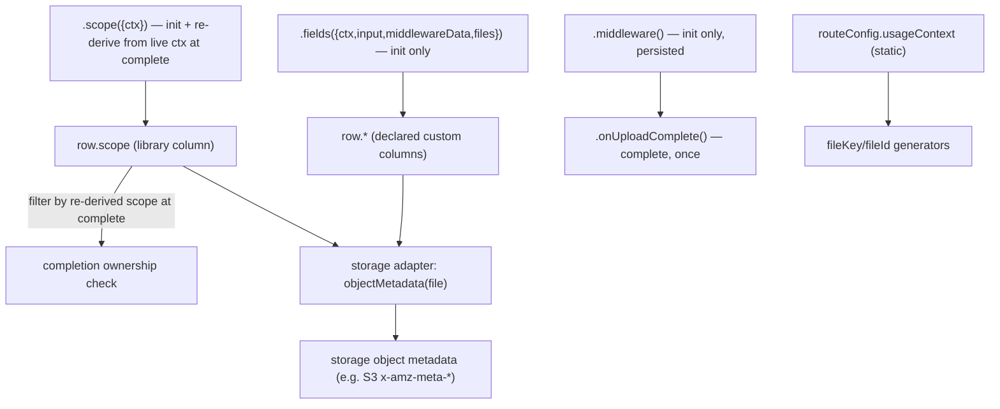

# refactor: Decouple auth/storage and make persisted file data customizable

## Summary

Remove the domain-coupled columns (`uploadedBy`, `entityId`) from the library's canonical file row. Replace ownership with an opaque, library-owned `scope` token derived per route, and let consumers declare their own typed persisted columns centrally on the `UploadStuff()` config. Split the overloaded "metadata" concept into two sinks: typed DB columns (the new `.fields()` system) and storage-object metadata, which moves into the storage adapter so the core carries no auth and no storage-vendor concepts. This is a breaking change across `@upload-stuff/core` and `@upload-stuff/server`; the client package is largely untouched.

---

## Problem Frame

Two domain concerns have leaked into a library that presents itself as generic file upload (see origin: `docs/brainstorms/2026-06-17-decouple-and-customize-file-data-requirements.md`).

`uploadedBy` is woven into the completion security model — `findFilesByBatchIdAndUploadedBy` and `updateFilesToStored` scope batch completion by owner (`packages/server/src/router/core.ts`), and `ValidContextObject` hardcodes a `userId?` field (`packages/core/src/types.ts`, `packages/core/src/router-types.ts`). `entityId` is the only structured value the `.metadata()` builder step produces (`packages/core/src/router-types.ts`), threaded into both a DB column and S3 object metadata with no consumer control. The word "metadata" is overloaded across two sinks with different lifecycles: `packages/server/src/adapters/s3.ts` forces three keys into S3 object metadata while `packages/server/src/router/core.ts` writes the same data as DB columns.

---

## Requirements

All origin requirements are in scope for this plan. Trace (Unit column lists every unit that cites the requirement group; see unit sections for per-requirement citations):

| Origin | What | Units |
|---|---|---|
| R1–R4 | Opaque `scope` ownership: `.scope()` method, persisted column, re-derived + filtered at complete, anonymous `?? null` semantics | U2, U3 |
| R5–R8 | Central typed custom-field declaration; `.fields()` resolver; end-to-end type flow; `entityId` no longer built in | U1, U2, U3, U4, U6, U7 |
| R9–R10 | Core/builder produce no storage metadata; storage adapter derives it via `objectMetadata` | U1, U5 |
| R11–R13 | Builder surface `input`/`scope`/`middleware`/`fields`/`onUploadComplete`; middleware runs init+complete, ephemeral; `ctx` user-defined | U1, U2, U3, U7 |
| R14–R16 | `DatabaseAdapter` scope-based method names; canonical row = state-machine columns + custom fields; `uploadSessionData = { input, middlewareData, endpoint }` | U1, U3, U4, U6, U7 |

---

## Key Technical Decisions

- **`scope` is a library-owned opaque column, derived from `ctx` only.** `.scope(({ ctx }) => string | undefined)` runs at init and again at completion; the completion lookup filters by the re-derived value. It reads `ctx` only — the live, server-verified context — so the completer's own identity is what's checked. It must not read `input`: input-derived scope re-derives the *original uploader's* value from stored input, letting any batchId holder pass the guard. Per-upload scope selection (personal vs org) is modeled as separate routes, or resolved in `createContext`, not as an `input` branch. The library never interprets the value. Replaces `uploadedBy`. (see origin)

- **Custom fields are declared centrally and typed.** Field set + types live on the `UploadStuff()` config (`fields: { entityId: { type: "string", required: false } }`); values are provided per route by `.fields(({ ctx, input, middlewareData, files }) => …)`, typed against the declaration. Central declaration is what lets the type reach the database adapter and gives a clear migration story. (see origin)

- **Storage object metadata is owned by the storage adapter.** The core and route builder produce no storage metadata. `s3Adapter({ objectMetadata })` derives it from the file row at presign time; default is `() => ({})` (empty), because `scope` — often a userId — would otherwise surface as an `x-amz-meta-scope` header on every GetObject, fully public on public buckets. Consumers opt in explicitly. Keeps the core storage-agnostic.

- **`usageContext` stays a route-config discriminator and library column — not a custom field.** It is static per route, the typed discriminator `TFileUsageContext` that parameterizes the library, and an input to key/id generation. Folding it into the request-resolved `.fields()` model would mix static config with resolved values and reorder key generation. Its only sink leak (S3) is now the adapter's `objectMetadata` concern.

- **`middleware` runs once, at init** (unchanged from today). It may throw to reject; its result is persisted in `uploadSessionData` and forwarded to `onUploadComplete` at completion. It is NOT re-run at completion — `scope` owns the completion ownership check, so re-running middleware would only add an idempotency footgun (side effects firing per completion attempt) with no authz gain. This revises origin R12, which had middleware re-run at completion. `uploadSessionData` stays `{ input, middlewareData, endpoint }`, with `input` persisted as the parsed (Standard-schema output) value.

- **`ctx` is fully user-defined.** `ValidContextObject` no longer requires `userId`. `DatabaseAdapter` methods rename to scope-based (`findFilesByBatchIdAndScope`, `updateFilesToStored({ batchId, scope, storedAt })`).

- **`entityId` is removed entirely.** It becomes a consumer-declared custom field where needed; the library ships zero domain columns.

---

## High-Level Technical Design

Each route resolver feeds a specific sink at a specific moment. The file row is the single source of truth the storage adapter reads from — the core never writes storage metadata directly.

Canonical row shape, before → after:

| Before (`DatabaseFile`) | After |
|---|---|
| state-machine columns (`id`, `key`, `filename`, `size`, `publicUrl`, `contentType`, `uploadSessionData`, `usageContext`, `isPublic`, `stored`, `storedAt`, `batchId`) | unchanged |
| `uploadedBy?` | `scope?` (opaque, library-owned) |
| `entityId?` | removed — declarable as a custom field |
| — | declared custom columns (typed, from central declaration) |

---

## Implementation Units

### U1. Decouple the persisted row, context, config, and adapter contracts (core types)

- **Goal:** Replace domain columns with `scope` plus a generic custom-fields type; make `ctx` user-defined; add the central field-declaration type; update adapter/storage interfaces.
- **Requirements:** R5, R8, R9, R13, R14, R15.
- **Dependencies:** none.
- **Files:** `packages/core/src/types.ts`, `packages/core/src/index.ts`.
- **Approach:** In `DatabaseFile`, drop `uploadedBy` and `entityId`, add `scope?: string`, and parameterize the row by the declared custom fields so persisted columns carry their types. Define `FieldAttributes` (`{ type, required }`) and a `FieldsDeclaration` record; add `fields?: FieldsDeclaration` to `UploadStuffConfig`. Relax `ValidContextObject` so it no longer requires `userId` (context becomes the user-supplied `TContext`). Rename `DatabaseAdapter.findFilesByBatchIdAndUploadedBy` → `findFilesByBatchIdAndScope` and the `uploadedBy` param on it and `updateFilesToStored` → `scope`, preserving the "`undefined` matches only ownerless" contract in the doc comments. Change `StorageAdapter.generatePresignedUpload` / `uploadFile` to receive the prepared file row (carrying `scope`, `usageContext`, and custom fields) instead of the flat `entityId`/`userId` bag, so any adapter can derive object metadata.
- **Patterns to follow:** existing generic threading on `DatabaseFile<TFileUsageContext>` and `DatabaseAdapter<TFileUsageContext>`; `SetOptional` usage in `UploadStuffConfig`.
- **Test scenarios:** Test expectation: none — type-only module; declaration-to-row inference is asserted in U2's type tests and exercised by downstream `check-types`.
- **Verification:** `pnpm check-types` passes for `@upload-stuff/core` with the new shapes; no remaining references to `uploadedBy`/`entityId` in the type surface.

### U2. Builder API: add `.scope()` and `.fields()`, remove `.metadata()` (core types + server builder)

- **Goal:** Replace the `entityId`-only metadata step with a typed `.fields()` resolver and a dedicated `.scope()` resolver, threading declared-field types end-to-end.
- **Requirements:** R1, R5, R6, R7, R8, R11.
- **Dependencies:** U1.
- **Files:** `packages/core/src/router-types.ts`, `packages/core/src/router-types.test-d.ts`, `packages/server/src/router/builder.ts`.
- **Approach:** Remove `MetadataObject` and `MetadataFn`. Add `ScopeFn = ({ ctx }) => string | undefined` (no `input` — see the scope KTD) and `FieldsFn = ({ ctx, input, middlewareData, files }) => <declared fields>` typed against the config's `FieldsDeclaration`. Generic threading (the load-bearing part, not just runtime accumulation): add a `TFields` parameter to `UploadStuff<TFileUsageContext, TFields>` and surface it on `$types.fields`; add a `_fieldsDeclaration` slot to `AnyParams`/`UploadBuilder`; seed it in `createUploadStuffRouter` from `TUploadStuff["$types"]["fields"]`. To avoid a U2↔U6 build cycle (the `builder.ts` wiring references the `$types.fields` slot U6 adds to `upload-stuff.ts`), give `createUploadStuffRouter` an explicit `TFields extends FieldsDeclaration` generic with a loose default so U2 type-checks alone; U6 supplies the bound value. Extend `UploadBuilder` with `.scope()`/`.fields()`, drop `.metadata()`, and carry `TFields` through `$types` so `onUploadComplete` and the surfaced data infer it. Mirror the chain in `internalCreateBuilder`: add `scope`/`fields` accumulation, drop `metadata`, keep the "already set" guards.
- **Patterns to follow:** the existing `UnsetMarker` / `ErrorMessage` chaining and the per-method immutable rebuild in `internalCreateBuilder`.
- **Test scenarios (type-level, `router-types.test-d.ts`):**
  - A declared `string` field makes `.fields()` require that key as a `string`; returning a `number` is a type error.
  - Omitting a `required: true` field from `.fields()` is a type error; optional fields may be omitted.
  - `.scope()` accepts `({ ctx }) => string | undefined`; `input` is not in its signature.
  - `.metadata()` no longer exists on the builder.
  - `ctx` typed without `userId` compiles.
- **Verification:** `pnpm check-types` passes; the type tests above fail to compile when the corresponding constraint is violated.

### U3. Init/complete handlers: scope guard, field persistence, middleware lifecycle

- **Goal:** Persist `scope` and custom fields at init, re-derive `scope` and re-run `middleware` at completion, filter the batch lookup by re-derived scope, and stop persisting `middlewareData`.
- **Requirements:** R2, R3, R4, R6, R12, R16.
- **Dependencies:** U1, U2.
- **Files:** `packages/server/src/router/core.ts`, `packages/server/src/router/handler.ts`, `packages/server/src/router/handler.test.ts`.
- **Approach:** In `handler.ts`, run `scope`, `middleware`, and `fields` at init; at completion run only `scope` (from the current `ctx`). In `core.initUpload`, compute `scope` and the custom-field values first, then pass the prepared row to both `generatePresignedUpload` and `createFiles`; write `scope` and custom fields to the row; keep `uploadSessionData = { input, middlewareData, endpoint }` (`input` persisted as the parsed value). In `core.completeUpload`, follow this exact order — the ordering is load-bearing for the security guard: (1) re-derive `scope` from the current `ctx`; (2) `findFilesByBatchIdAndScope({ batchId, scope })` keeping `?? null` anonymous semantics; (3) reject with "No files found" if empty — this is the ownership rejection; (4) endpoint guard against the stored `endpoint`; (5) storage verification; (6) `updateFilesToStored({ batchId, scope, storedAt })` whose `updatedCount === 0` now signals idempotent re-completion only; (7) `onUploadComplete` with the stored `input` and stored `middlewareData`. Middleware is not re-run at completion.
- **Execution note:** Start with the failing completion-guard tests below before changing `completeUpload` — this is the security-bearing change.
- **Patterns to follow:** existing `Promise.all` prepare-then-persist structure in `initUpload`; the `updatedCount === 0` already-completed signal.
- **Test scenarios (`handler.test.ts`, update the in-memory adapter to scope-based methods):**
  - Covers AE1. Re-derived scope (from `ctx`) matches the init scope → batch finalizes, `onUploadComplete` runs once.
  - Covers AE2. A different completing `ctx` re-derives a different scope → lookup matches nothing, completion rejects, `onUploadComplete` does not run.
  - Covers AE3. `scope` undefined (anonymous) → any completion with the batchId finalizes.
  - Idempotent completion: second complete updates 0 rows and does not re-run `onUploadComplete`.
  - Endpoint guard: completing through a different endpoint rejects.
  - Custom fields returned by `.fields()` are present on the created rows at init.
  - `onUploadComplete` receives the stored `input` and stored `middlewareData`.
- **Verification:** the scenarios pass; no `uploadedBy` references remain in `core.ts`/`handler.ts`; `uploadSessionData` no longer carries `middlewareData`.

### U4. Prisma reference adapter: scope-based methods and custom-field passthrough

- **Goal:** Align the reference adapter with the renamed interface and confirm declared custom columns pass through.
- **Requirements:** R14, R7.
- **Dependencies:** U1.
- **Files:** `packages/server/src/adapters/prisma.ts`, `packages/server/src/adapters/prisma.test.ts`.
- **Approach:** Rename `findFilesByBatchIdAndUploadedBy` → `findFilesByBatchIdAndScope`, switch the `where` clause from `uploadedBy` to `scope` (keep `?? null`), and rename the `uploadedBy` param on `updateFilesToStored` → `scope`. The existing `...file` spread in `createFiles`/`updateFile` already forwards arbitrary declared columns — keep it; note in the model that custom columns must exist in the consumer's Prisma schema. Scope of R7's type guarantee: declared field types reach the builder `.fields()` resolver and `onUploadComplete`, but NOT the `prismaAdapter` instance — its Prisma delegate is structurally `any`, so the adapter boundary stays permissive and the column passthrough is structural, not type-checked. Do not over-promise adapter-side typing.
- **Patterns to follow:** the existing `?? null` comments explaining Prisma's `undefined`-drops-clause behavior.
- **Test scenarios (`prisma.test.ts`):**
  - `findFilesByBatchIdAndScope` with a defined scope returns only that scope's rows; with `undefined` returns only ownerless rows.
  - `updateFilesToStored` scoped by `scope` updates only matching unstored rows and reports the count.
  - A declared custom column provided to `createFiles` round-trips through the adapter.
- **Verification:** adapter tests pass against the renamed interface; no `uploadedBy` references remain.

### U5. S3 adapter: remove hardcoded metadata, add `objectMetadata`

- **Goal:** Stop hardcoding `uploaded-by`/`usage-context`/`entity-id`; derive object metadata from the file row via a configurable hook.
- **Requirements:** R9, R10.
- **Dependencies:** U1.
- **Files:** `packages/server/src/adapters/s3.ts`.
- **Approach:** Add `objectMetadata?: (file) => Record<string, string>` to `s3Adapter`, defaulting to `() => ({})` (empty — see the storage-metadata KTD on why `scope` is not exposed by default). Build the `PutObjectCommand` `Metadata` from this hook using the prepared row passed by U1's interface change, instead of the fixed three keys.
- **Patterns to follow:** existing `buildPutObjectInput` shared between presign and direct upload.
- **Test scenarios:** Test expectation: none beyond type-check — adapter behavior is S3-network-bound and exercised through the handler flow; the metadata shape is covered by inspection and `check-types`. (If a unit test is cheap, assert that the default `objectMetadata` produces an empty `Metadata`, and that a custom `objectMetadata` maps onto the put input.)
- **Verification:** `check-types` passes; default object metadata is empty; no fixed `entity-id`/`uploaded-by`/`usage-context` keys remain.

### U6. Wire central field declaration into `UploadStuff` and `serverUtils`

- **Goal:** Thread the config-level `fields` declaration through instance creation and update the direct-upload helper's data shape.
- **Requirements:** R5, R8, R15.
- **Dependencies:** U1, U2.
- **Files:** `packages/server/src/upload-stuff.ts`.
- **Approach:** Accept and carry `fields` from `CreateUploadStuffConfig` through to the builder/handler typing. In `serverUtils.uploadFile`, drop `uploadedBy`/`entityId` from the accepted `data` and accept `scope` plus declared custom fields; keep the DB-row-first-then-storage ordering and the `stored: false` reclaim path.
- **Patterns to follow:** the existing `__`-prefixed adapter/generator passthrough on the `UploadStuff` return value.
- **Test scenarios:** Test expectation: none new — exercised via U3's handler tests and `check-types`; if present, extend an existing `serverUtils.uploadFile` test to pass `scope` and a custom field.
- **Verification:** `check-types` passes; `serverUtils.uploadFile` compiles with `scope` + declared fields and rejects `uploadedBy`/`entityId`.

### U7. Update README to the new API

- **Goal:** Document the new builder surface, central field declaration, `scope`, `objectMetadata`, and the reference `File` model.
- **Requirements:** R5, R8, R11, R14.
- **Dependencies:** U1–U6.
- **Files:** `README.md`.
- **Approach:** Update the router example to use `.scope()`/`.fields()` and a user-defined `ctx` without `userId`; show `fields` declaration on `UploadStuff()`; show `s3Adapter({ objectMetadata })`; replace `uploadedBy`/`entityId` in the reference Prisma `File` model with `scope` plus example declared columns; update the route-builder method table (drop `.metadata`, add `.scope`/`.fields`). Include one worked end-to-end recipe for the common per-user case (`fields` declaration → DB column → `.scope(({ ctx }) => ctx.userId)` → reference `File` model) so the common shape reads as a recipe, not raw assembly.
- **Patterns to follow:** the existing README structure and example style.
- **Test scenarios:** Test expectation: none — documentation.
- **Verification:** README examples match the shipped API surface; no `uploadedBy`/`entityId`/`.metadata()` references remain.

---

## Scope Boundaries

**In scope:** all origin requirements R1–R16 across `@upload-stuff/core` and `@upload-stuff/server`, plus README.

**Deferred to Follow-Up Work**

- Rewriting the `apps/docs` documentation site content to the new API — large separate surface, handled after the core/server change lands. Its Twoslash samples will not compile against the new API in the interim (accepted; see Risks — no site users yet).
- `.fields()` re-running at completion to update columns — init-only here. Consequence: completion-derived columns (etag, server-verified size from `verifyUpload`) are not populatable by `.fields()`; a complete-time field hook is the natural follow-up if those become wanted.
- `objectMetadata` support on storage adapters other than S3.
- Helpers for composite/multi-dimension scopes — the opaque string already supports them by convention.

**Outside this library's identity** (carried from origin)

- The library managing auth, sessions, or users — ownership stays an opaque token supplied by the consumer.
- A general-purpose Prisma adapter — it remains a reference adapter for one `File` shape.

---

## Risks & Dependencies

- **Breaking change to the entire public API** (builder, adapter interfaces, `ctx` type, persisted columns). Accepted because the library is young; no migration path for existing consumers is provided. Ship under a single changeset describing the new surface.
- **`.scope()` must derive from live `ctx` and be deterministic per principal.** Same value at init and completion for the same principal. Deriving from `input` is forbidden — at completion `input` is the original uploader's stored value, so an input-derived scope re-derives the owner's value and any batchId holder bypasses the guard; the `({ ctx })`-only signature enforces this. Non-determinism (e.g. `Date.now()`) silently breaks completion. Document on `.scope()`.
- **Field availability at presign time.** Custom fields and `scope` must be computed before `generatePresignedUpload`, since object metadata is baked into the presigned PUT. U3 reorders `initUpload` to compute-then-presign; pass `generatePresignedUpload` a typed subset (`key`, `contentType`, `size`, `isPublic`, `usageContext`, `scope`, custom fields) rather than the full `DatabaseFile`, so `publicUrl` generation stays concurrent with presign.
- **Consumer schema drift and the `uploadedBy` → `scope` rename on live data.** Declared custom columns and `scope` must exist in the consumer's schema. Migration hazard: adding a NULL `scope` column instead of renaming `uploadedBy` leaves in-flight owned batches with `scope = NULL` → anonymous → completable by anyone (ownership downgrade). Document: rename-and-backfill `uploadedBy` → `scope`, do not add-with-NULL while batches are in flight; until the column exists, init/complete throw unknown-column at runtime.
- **`required` is table-wide, not per-route.** A field required by one route but irrelevant to another must be declared `required: false` centrally, so per-route mandatory fields can't be enforced at the type level. Documented, not designed around.
- **Anonymous `onUploadComplete` is publicly triggerable.** With `scope` undefined, any caller holding the batchId can trigger completion and run `onUploadComplete`. Use anonymous routes only when that callback is idempotent and has no security-sensitive side effects; document on `.scope()` / anonymous uploads.
- **Deferred docs build is knowingly red.** `apps/docs` Twoslash samples reference the removed API (`.metadata`, `uploadedBy`, `ctx.userId`) and `pnpm check-types` is scoped to `./packages/*`, so it will report green while the `apps/docs` build fails until the deferred docs rewrite lands. Accepted (no site users yet); do not gate the package release on the docs build.

---

## System-Wide Impact

- **`@upload-stuff/core` type changes ripple outward.** `DatabaseFile`, `ValidContextObject`, `UploadStuffConfig`, and the adapter/storage interfaces are consumed by `@upload-stuff/server` (handlers, adapters, builder) and re-exported types reach `@upload-stuff/client`. Run `pnpm check-types` across the workspace after U1–U2.
- **Next.js handler.** `packages/server/src/next/http-server.ts` wires `createContext` → handlers; relaxing `ValidContextObject` removes the implicit `userId` requirement on the consumer's context type but needs no functional change. Confirm its generics still compile.
- **Client package.** `packages/client/src/impl.ts` sends only `{ input, files }` then `{ batchId }`; it carries no `uploadedBy`/`entityId`/metadata, so it changes only via re-exported types (e.g. `inferRouteServerData`). No request-shape change.

---

## Sources & Research

- Origin: `docs/brainstorms/2026-06-17-decouple-and-customize-file-data-requirements.md`.
- `packages/core/src/types.ts`, `packages/core/src/router-types.ts` — row, context, config, builder, adapter types.
- `packages/server/src/router/core.ts`, `packages/server/src/router/handler.ts` — init/complete flow, `uploadedBy` filter, `uploadSessionData`.
- `packages/server/src/adapters/s3.ts`, `packages/server/src/adapters/prisma.ts` — current object-metadata population and `?? null` scoping semantics.
- `packages/server/src/router/handler.test.ts`, `packages/server/src/adapters/prisma.test.ts` — existing behavioral coverage to update.
- `README.md` — current public API and reference `File` model.
- BetterAuth `additionalFields` (declaration-model reference): central per-field `{ type, required, defaultValue, input }` on the auth config, with end-to-end type inference.
